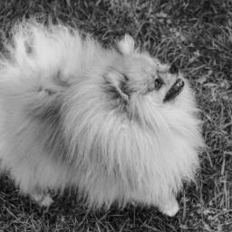
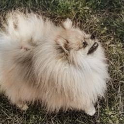
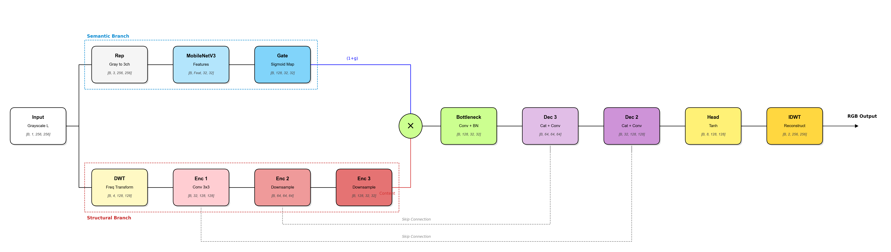
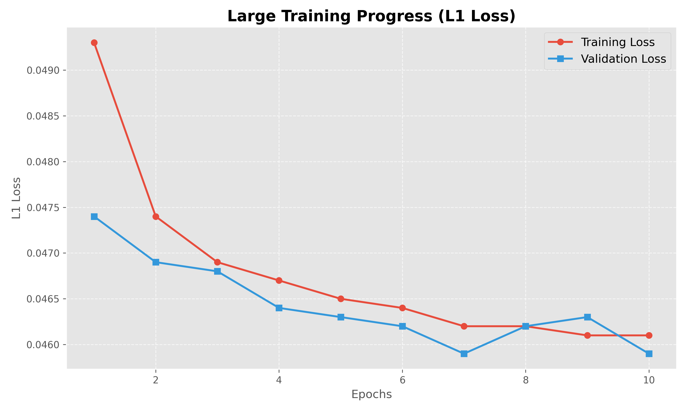

# TFCM: Tiny Frequency Colorize Model

**A hybrid architecture for high-fidelity image colorization using Discrete Wavelet Transforms and MobileNetV3.**

| Input (Grayscale) | Output (TFCM Prediction) |
|:---:|:---:|
|  |  |
|  |  |

***image not from the COCO database**

## Overview

**TFCM** is an experimental deep learning model designed to solve the "washed out" color problem common in traditional CNNs. By processing images in the frequency domain, it separates structural details from semantic understanding.

*Training and inference code coming soon*

## Architecture

The core innovation of TFCM is its dual-branch topology:

1.  **Semantic Branch (Blue):** Powered by a pre-trained **MobileNetV3 Large**. It analyzes the image content (context) to understand *what* the objects are (e.g., sky, grass, car) and generates a "Gating Map".
2.  **Structural Branch (Red):** Instead of standard pixel processing, this branch uses **Discrete Wavelet Transforms (DWT)**. Wavelets split the image into frequency bands, preserving high-frequency details (edges, textures) that are often lost in standard convolutions.
3.  **Fusion:** The semantic gate modulates the structural features (`Structure * (1 + Context)`), ensuring that colors are applied logically without blurring the fine details.

## Dataset & Scalability

The current model was trained on the **COCO 2017 HD** dataset.
*   **Current Resolution:** Resized to 256x256 for this release.
*   **Scalability:** This architecture is highly promising for High-Resolution (4K) image processing. The DWT-based approach reduces spatial dimensions without losing information, making it computationally efficient for larger inputs compared to standard UNets.

## Training Results

The model exhibits stable convergence with minimal overfitting. The separation of structure and semantics allows the loss to decrease steadily.

## License

This project is licensed under the **Apache License 2.0**.
You are free to use, modify, and distribute this software for personal or commercial use, provided you include the original copyright notice and license.